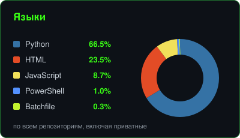
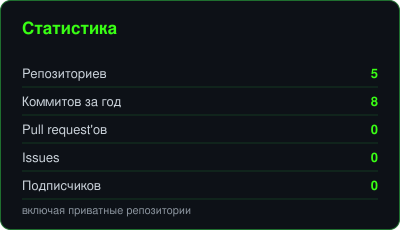

<!-- ======================= ASCII TERMINAL BANNER ======================= -->
<div align="center">

```
██████╗  █████╗ ████████╗███╗   ███╗ █████╗ ███╗   ██╗
██╔══██╗██╔══██╗╚══██╔══╝████╗ ████║██╔══██╗████╗  ██║
██████╔╝███████║   ██║   ██╔████╔██║███████║██╔██╗ ██║
██╔══██╗██╔══██║   ██║   ██║╚██╔╝██║██╔══██║██║╚██╗██║
██████╔╝██║  ██║   ██║   ██║ ╚═╝ ██║██║  ██║██║ ╚████║
╚═════╝ ╚═╝  ╚═╝   ╚═╝   ╚═╝     ╚═╝╚═╝  ╚═╝╚═╝  ╚═══╝
```

<!-- typing animation (RU) -->
<a href="https://git.io/typing-svg">
  
</a>

<br/>

<!-- пробелы в label обязательны: komarev считает ширину кириллицы заниженной и обрезает текст -->


</div>

<!-- ======================= WHOAMI TERMINAL ======================= -->

```bash
гость@github:~$ whoami

  ┌─[ КТО Я ]─────────────────────────────────────────
  │  роль        : Фулстек-разработчик
  │  стек        : Python · Java · JavaScript · Kotlin
  │  направление : Веб · Android · ИИ / автоматизация
  │  сейчас      : пилю торговых ботов и AI-инструменты
  │  девиз       : «сначала запусти — потом сделай красиво»
  └───────────────────────────────────────────────────

гость@github:~$ cat стек.txt
```

<!-- ======================= TECH STACK ======================= -->
<div align="center">

### `> СТЕК`


<br/>


</div>

<!-- ======================= STATS ======================= -->
<div align="center">

### `> СТАТИСТИКА`


<br/><br/>


</div>

<!-- ======================= LANGUAGES ======================= -->
<div align="center">

### `> ЯЗЫКИ`




<br/><br/>


</div>

<!-- ======================= ACTIVITY GRAPH ======================= -->
<div align="center">

### `> АКТИВНОСТЬ`


</div>

<!-- ======================= SNAKE ======================= -->
<div align="center">

### `> ЗМЕЙКА`

<picture>
  <source media="(prefers-color-scheme: dark)" srcset="https://raw.githubusercontent.com/abdullo-rich/abdullo-rich/output/github-snake-dark.svg" />
  <source media="(prefers-color-scheme: light)" srcset="https://raw.githubusercontent.com/abdullo-rich/abdullo-rich/output/github-snake.svg" />
  
</picture>

</div>

<!-- ======================= CONNECT ======================= -->
<div align="center">

### `> СВЯЗЬ`

<a href="https://t.me/Top_maneger"></a>
<a href="mailto:azimovabdullo770@gmail.com"></a>
<a href="https://github.com/abdullo-rich"></a>

<br/><br/>

```
гость@github:~$ exit
logout
[ Соединение закрыто. Спасибо, что заглянул 👾 ]
```


</div>
